# Lab 1: Task Manager App
**Group members:** Emily Zhang, Christopher Chung, Olina Wong

For Lab 1, we aimed to design a modern, simple interface for a mobile web app that functions as a task manager.
The app handles various tasks including creating, renaming, and marking items as well as showing uncompleted items and deleting completed items.
For final screen images and flows for each task, see the bottom of this design doc.

### Design Process, Decisions, and Early Mock-Ups
From left to right, the following screenshots represent the stages of our mock-up process (a through e).

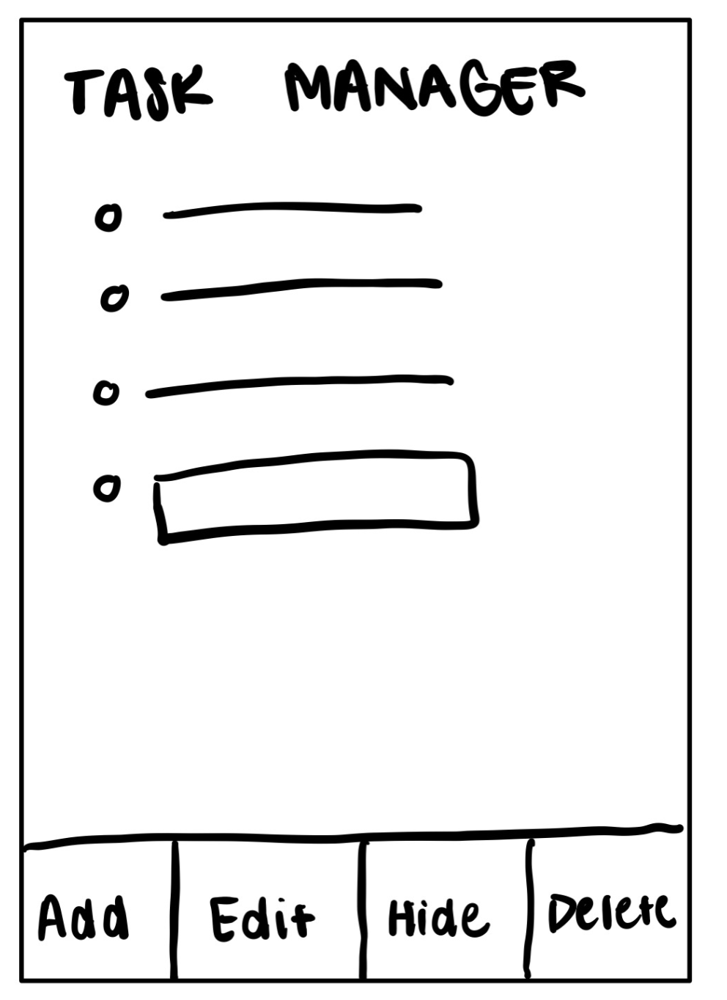
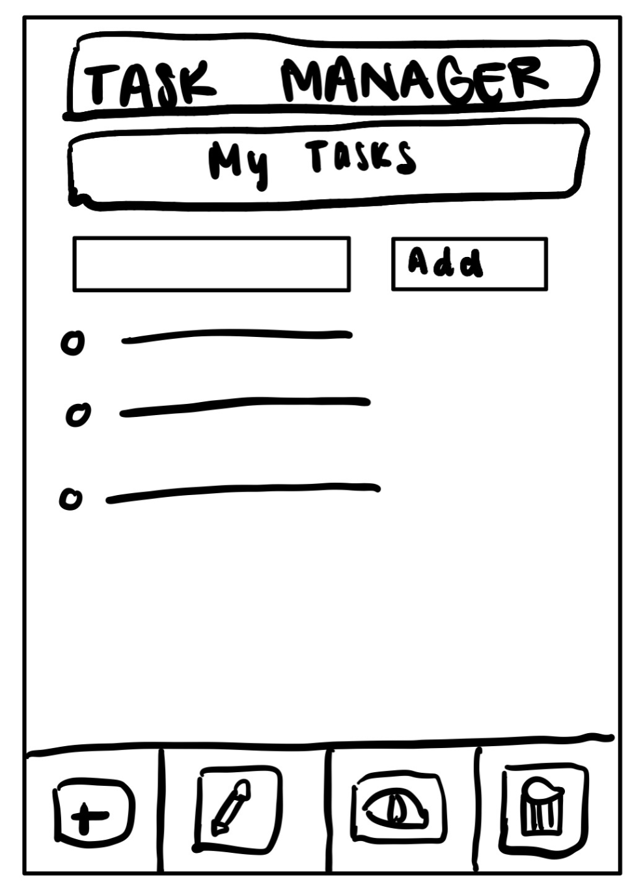
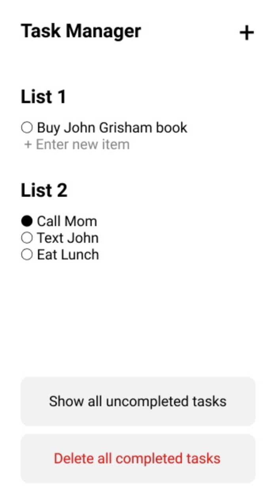
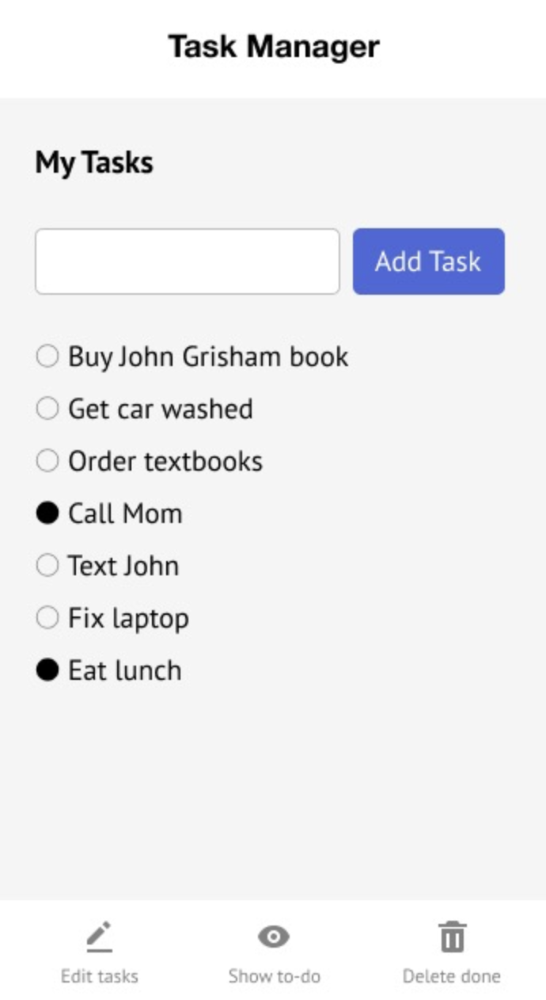
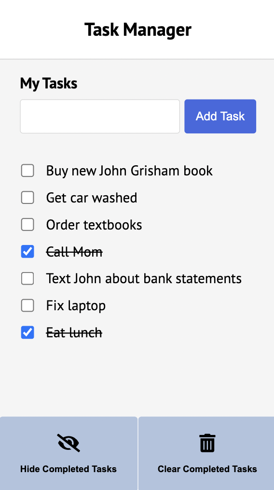

- a. **First Idea/Early Sketch:** In our earliest sketch, we laid out a design that supports the basic functionalities: add, edit, hide, and delete. We had a basic checklist of items with an option to add a new item at the bottom of the list.
- b. **Iteration 2:** We moved the add item button to the top of the list and added more styling to the app, via icons, buttons, and headers.
- c. **Iteration 3:** At this point, we decided to focus on highlighting the “show all uncompleted tasks” and the “delete all uncompleted tasks” buttons instead of all 4 functionalities, since these were the 2 key functionalities that we were asked to implement. We made several mockups in Figma to visualize our potential design. We quite like this iteration that supports adding to multiple lists and we may consider revisiting this in future labs.
- d. **Iteration 4:** We decided to revert back to our toolbar approach here for a mobile-friendly layout, and we adopted the use of both icons and text for the buttons so the toolbar’s purpose is more clear to the user. We incorporated a cohesive modern style and color theme into the app.
- e. **Final Implementation:** In this final screenshot representing the existing state of our app, we combined a variety of design decisions throughout the process based on user feedback on testing. For example, we removed the edit tasks button because we realized users would need to click on that button to “unlock” edit access each time they wanted to rename or adjust a task.

### Key Design Decisions
*Decision 1: Creating a toolbar at the bottom of the app*
- Initially, the functions of the app ("Add/Edit Tasks", “Hide Completed Tasks”, and “Clear Completed Tasks”) were arbitrarily placed as different buttons around the app. The toolbar consolidates these functions into an easily accessible toolbar for a mobile-first approach, with the actions "Hide Completed Tasks” and “Clear Completed Tasks.” 
- We decided to put the  By placing these actions at the bottom, this would reduce travel time for the user’s finger and reduce cognitive overload by action search. The navigation bar is persistent to allow the user to always access these functions. However, if either of these functionalities are not supported (e.g. there are no completed tasks to clear, then the user clicking on the button will result in no functionality.

*Decision 2: The “Add Task” button location and styling*
- The text box and “Add Task” button are placed above the list of items. Initially, we wanted the approach of a traditional notebook by placing the text box at the bottom of the list. However, accounting for an expanded list that stretches past off screen, we decided to have the “Add Task” button at the top so the user will always have it easily accessible as a common feature.
- In terms of the styling, we chose a prominent blue color to contrast against the rest of the white/grey interface, signaling a high-priority task.

*Decision 3: Icons and Text*
- We added icons to the toolbar actions to facilitate visual priority in addition to reading the text for finding every desired action. We decided to pick an icon with a slash through an eye to represent the idea of hiding, and also an icon of a trash can to delete completed items. The icons are understandable and the subtext allows a user to double-check their action prior to executing it. We also included clear captions for the two icons for users to understand the purpose of the toolbar. 

### Alternative Designs
The following are some alternative design ideas that we considered, in addition to the ones we documented above in our sketching and mock-up process:
- **Position of the Add Task input box and button:**
  We considered putting the add task button at the bottom of the list or having it off to the side rather than the top. After a bit of user testing and feedback, we realized that it was most convenient for the add task functionality to be prominently placed at the top of the list for ease of access. Particularly when the list of task items grows long, and because this is a mobile app, it would be inconvenient for the user to have to scroll through a long list of tasks in order to add a task.
- **App actions as wide buttons:**
The buttons were originally screen-width wide, simply functioning as large buttons for the users to press. This took a lot of screen real estate and fit into the mental model of choosing between equivalent alternative tasks, which is not the intended function of the available tools.

### User Testing
We did some user experience research by asking 4 friends to navigate through our app's screen images while performing some of the tasks. For example, we asked them to talk out loud as they walked through what steps they would take to add a task or rename a task. We iteratively changed our design to ensure that the app was intuitive and clear in what functionalities it performed.

We also asked some of the following specific questions:
- Where would you rather have an "add task" button be located?
- What are some important must-haves for a to-do list manager app?
- How would you go about renaming a task in this app? Where would you click?

We noted down the flow of taps and interactions the user had with the app and made some changes if we found that one particular flow was confusing or took too long. For example, we decided to add a toolbar with two clear buttons and simplified the process of editing and renaming a task instead of locking it behind another button.

### Challenges
The following are some challenges that we faced:
- **Deciding what order to approach the design process**: Initially, we began with implementing a simple HTML page of all the static pages. However, when we began styling the CSS, we realized we did not have adequate 
 and class descriptors, which affected our ability to organize and format the CSS styling. Moving forward, we will be more conscious about implementing appropriate descriptors early in the implementation process.
- **CSS formatting**: We had difficulties working with CSS Flexbox and list styling. Some common issues were overlapping parts, nonfunctional CSS, and inconsistent font sizes. In the future, we will work with 
 containers to clarify the formatting of each object. We also hope to find a solution for consistent text sizing, which required a universal (*) workaround with a font size percentage.
- **Toolbar model**: In order to make the actions of the app easily understandable, we cycled through different designs for the toolbar before settling on the current toolbar with both icons and text. Using the principle of proximity, we standardized the buttons to help the user understand that the actions all modify something with the list.

### Parts We’re Proud Of
- Iteratively walking through the design process: low fidelity sketches, high fidelity prototypes, initial implementation, user testing, and final implementation
- Implementing a persistent toolbar reminiscent of mobile nav bars
- Consistent margins and padding using containers
- Implementing some interactive and dynamic aspects of the design (for example, marking a checkbox as done will strikethrough the task, implying it is no longer relevant)
- Minimalistic but functional visual design

### Final Design
Below you will find the screen images and flow for each task.

1. In an empty list, create an item named "Buy new John Grisham book"
   - Before: User sees a message “No current tasks.”
   - User Actions/During: User clicks on the add task input box at the top => User types in the name of a new task => User clicks on the add task button
   - After: A new task is created “Buy new John Grisham book” in the list
  
  

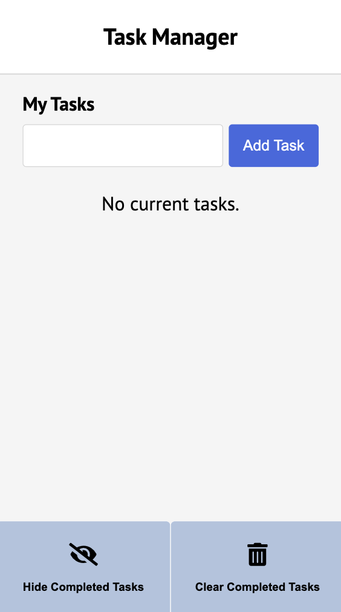
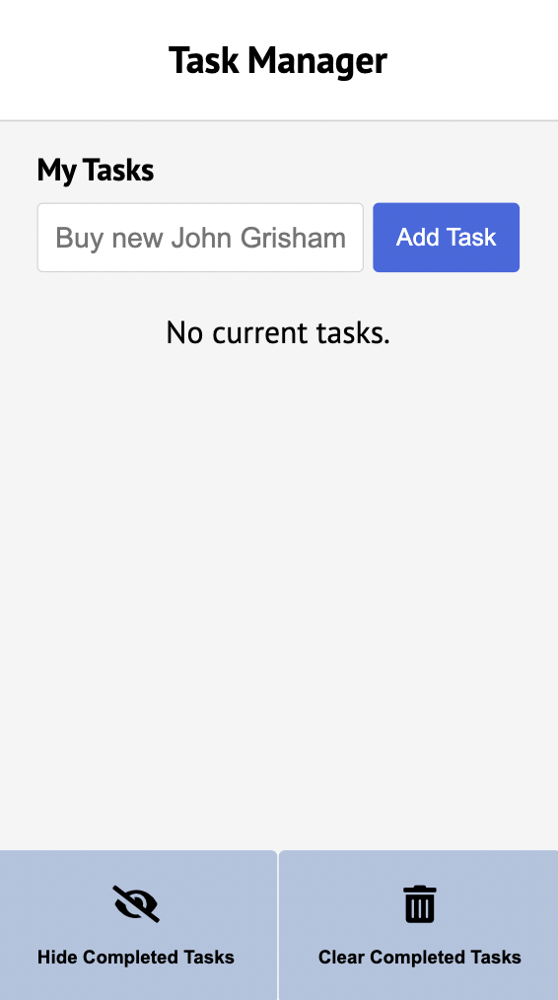
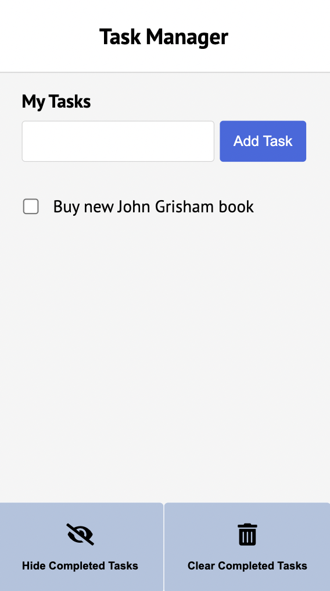

2. In a non-empty list, create an item named "Eat Lunch"
   - Before: User sees a list of tasks.
   - User Actions/During: User clicks on the add task input box at the top => User types in the name of a new task => User clicks on the add task button
   - After: A new task, “Buy new John Grisham book,” is added to the current list
 

    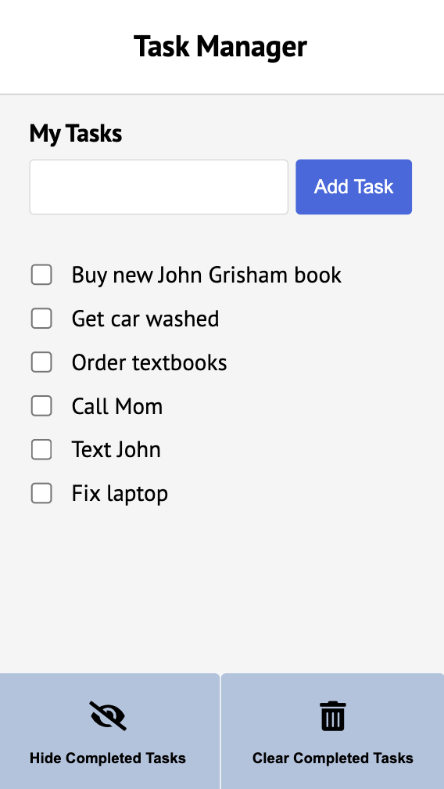
    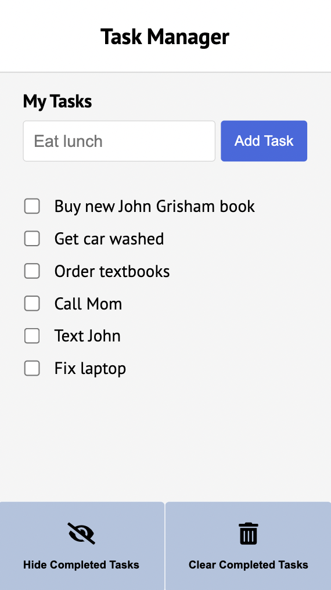
    
    

3. Mark the item named "Call Mom" completed (assumes there exists an item named "Call Mom").
   - Before: User sees a list of tasks. “Call Mom” is not checked.
   - User Actions/During: User clicks on the checkbox associated with the “Call Mom” task
   - After: The checkbox associated with the “Call Mom” task is checked blue.

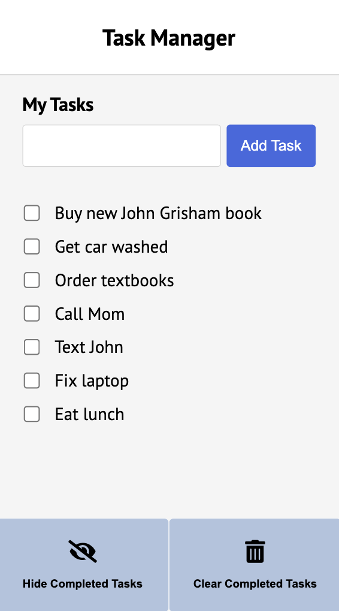
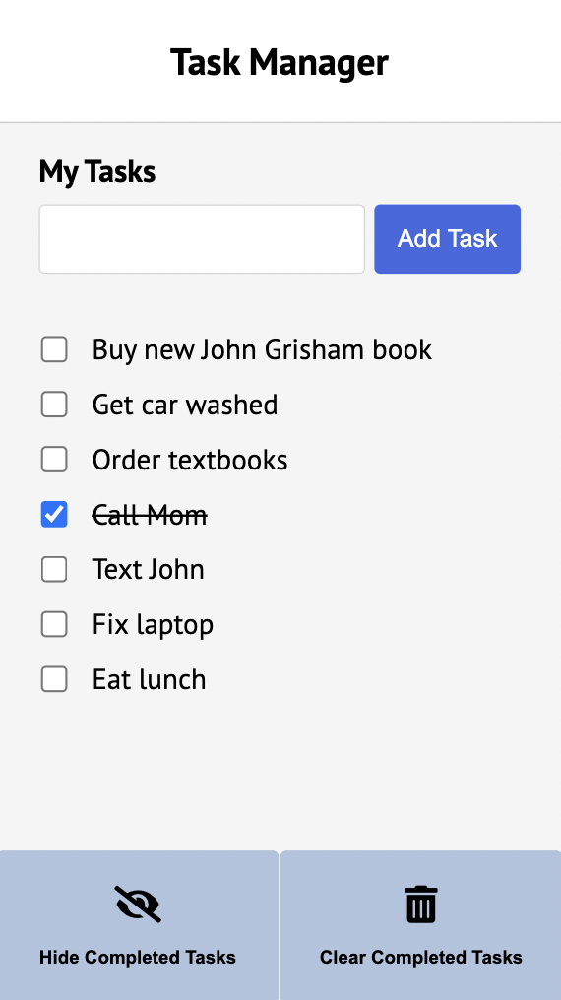

4. Rename the item "Text John" to "Text John about bank statements" (assumes there exists an item named "Text John").
   - Before: User sees a list of tasks. “Text John” is one of these tasks.
   - User Actions/During: User double clicks on the item named “Text John” => User edits the task and types in “Text John about bank statements” => User clicks out to save
   - After: The “Text John” task appears as “Text John about bank statements”

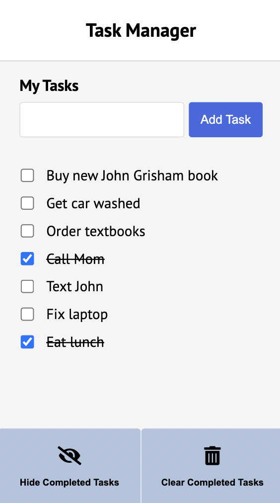
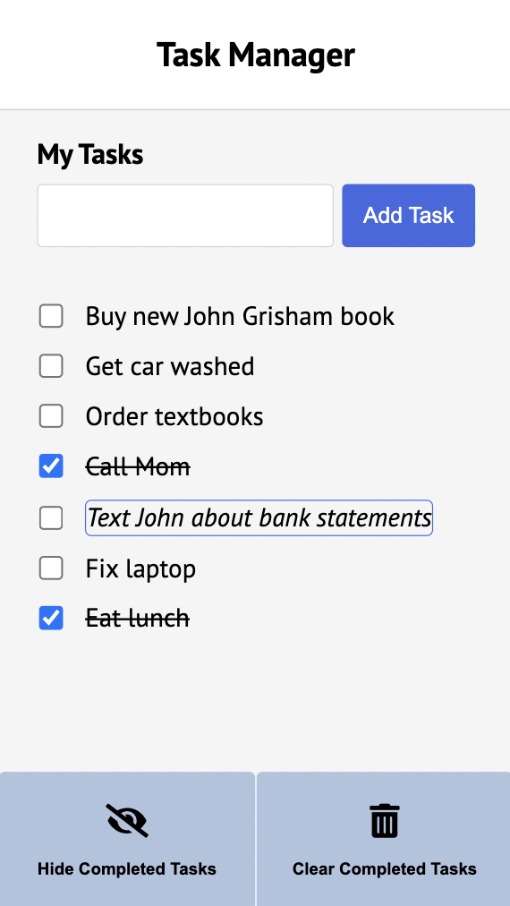
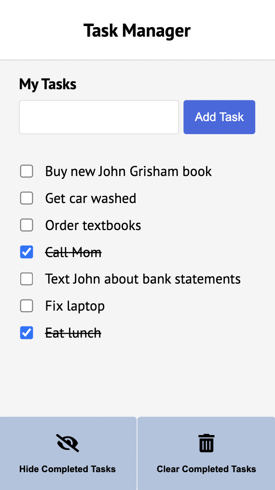

5. Show only uncompleted items.
   - Before: A list of tasks is displayed, with 5 uncompleted items and 2 completed items.
   - User Actions/During: User taps on the icon at the bottom that represents “Show only uncompleted”
   - After: A list of tasks is displayed, with 5 uncompleted items.

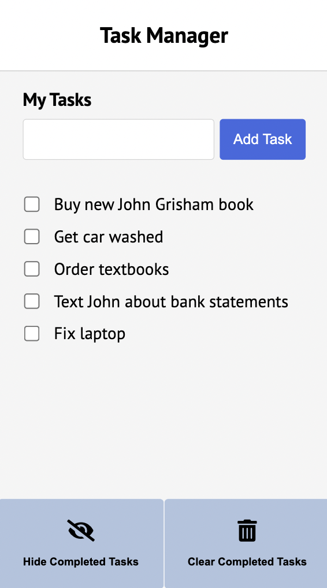

6. Delete all completed items.
   - Before: User sees a list of tasks, with 5 uncompleted items and 2 completed items.
   - User Actions/During: User taps on the icon on the bottom that represents “Delete completed”
   - After: A list of tasks is displayed, with 5 uncompleted items.

