# Lab 3: Task Manager App using Firestore
**Group members:** Emily Zhang, Christopher Chung, Olina Wong

For Lab 3, we iterated on our working Task Manager app from Lab 2 by supporting 3 new key functionalities.
- using Firestore for permanent cloud storage
- adding priority level to tasks
- allowing sorting of tasks by task priority, task name, and creation date (default sorting)

The app continues to handle various tasks including creating, renaming, and marking items as well as showing uncompleted items and deleting completed items – all this data is synced and modified in real-time through Firestore. For final screen images and flows for each task, see the bottom of this design doc.

### Design Process, Decisions, and Early Mock-Ups

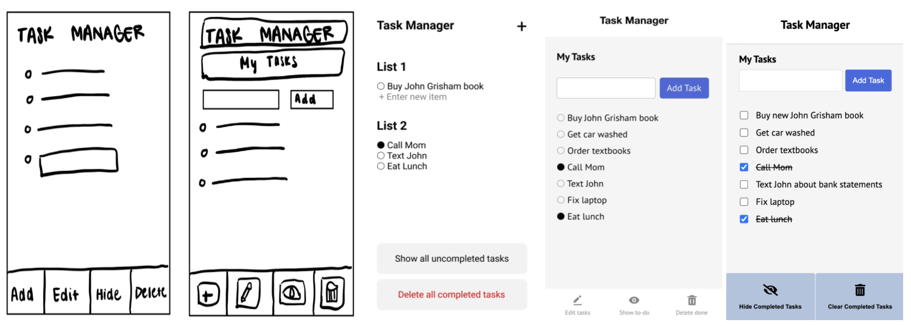

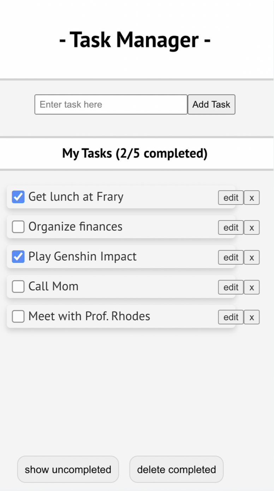
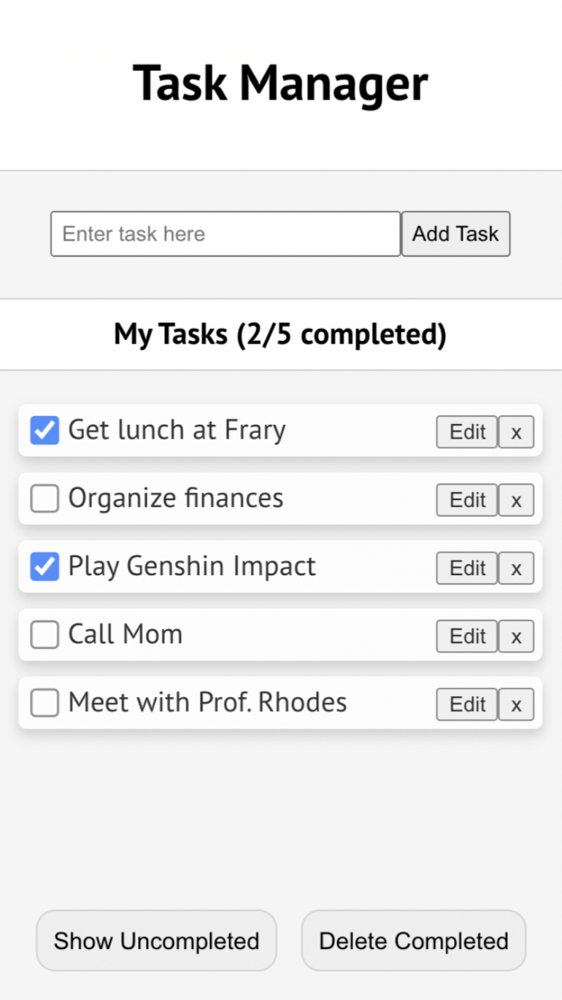
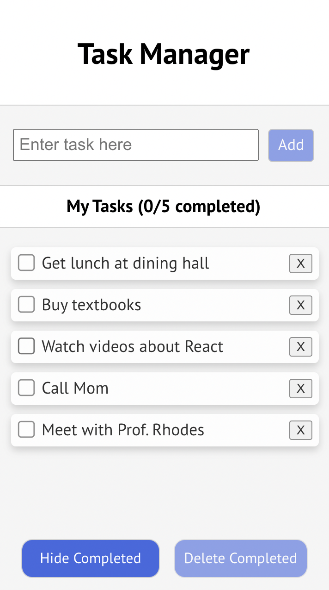

Progressive renders of our app. Since lab 1, we decided to simplify the tool bar into two Hide Completed and Delete completed buttons. We also changed the styling of the tasks by moving them into containers, and we implemented functionality for renaming tasks and deleting them. The final version removes the separate edit button and adds color context for the toolbar. It also greys out the buttons when they are inactive to make the interface more intuitive and prevent user error. 

### Key Design Decisions
- **Added the functionality of deleting a single task**: Prior to our redesign, deleting a task required selecting the desired tasks to delete and clicking a delete button at the navigation bar. Because we expected a common function to be deleting only a single task, we included the ability to delete a single task in one quick action by adding buttons into the individual task containers.
- **Directly editing text**: We also anticipated that a common function would be to edit a task when desired. Previously, you had to delete a task to make the appropriate task. This new functionality allows the user to edit the task without the extended process of deleting the task, typing a new task, and adding a task.
- **Changed the toolbar at the bottom to just two labeled buttons**: After rationalizing the design decisions above, we compressed the toolbar into just two labeled buttons: “Show uncompleted tasks” and “Delete completed tasks”. Previously, we had three buttons, with the additional button as “Edit tasks”. We reduced cognitive travel by spatially relocating the commonly used task buttons and reducing the clicks needed to complete the task.
- **Add color context for buttons**: Buttons now have color to communicate whether an action is doable (For example, delete Completed is grayed out since no items are completed).

### Alternative Designs
- **Highlighting a task when you edit it**: We considered highlighting the task when you edit to make the action more obvious. However, upon our implementation, we realized this would be redundant since the form to fill out the edited task is conspicuous for the user.
- **Moving add task to the bottom**: We considered the possibility of a shorter finger travel time if the add task is at the bottom. However, after reflecting upon common user interfaces in apps, we determined that although this addition would be more efficient, this did not fit the cognitive model found in most other apps of creating a new task; the new task button is typically in the top right.
- **Categorizing tasks under Completed or Uncompleted**: We considered putting tasks into a couple different categories and groups so that the app would display as a two sections of task lists instead of just one. However, with some user testing, we learned that the one-task approach was most intuitive when users were editing and modifying tasks frequently.

### User Testing
In order to test our new functionality without a large user testing group, we conducted internal testing within our group. When one of our group members implements a new function, we test the functionality with the other group member(s) during meetups, allowing us to have a fresh perspective on the app.

We had an open session asking our group members unfamiliar with the new changes to play with the app and test out desired tasks, such as the functionality of creating a new item, editing a task, and the usage of the buttons in the navigation bar. In addition, we asked several roommates and friends to navigate through the app, encouraging them to talk out loud and articulate any parts of the process that were unclear.

Some key questions we asked were:
- What are you trying to do? (Determining intended purpose)
- Does this workflow feel like it makes sense? (Asking for intuition)
- Is there anything you’re confused about? (Clarity of content)

We had positive reception for the cleaner user interface and the tasks completed ticker. Users commented that it was easy to navigate through the app and modify their tasks, and it was something they could use on a daily basis.

A couple key suggestions that we later incorporated included:
- Ensuring that the pop-up modal for the delete completed button is deactivated if there are no completed icons. This seemed to be a source of confusion for one user.
- Ensuring that the tasks do not overlap with each other or go out of the box if there are particularly long task labels or many tasks.
- In the later sections, we describe the challenges we ran into and parts we’re proud of while taking these suggestions into consideration and implementing these changes.

### Challenges
- **Separating our files into components**: We found it challenging to parse our previous HTML content and separate them into appropriate components. It was helpful to start from the initialData in our index.js, working our way through inMemoryApp, App.js, and the components in the actual application
- **Moving the data into an intermediate file**: Handling data was difficult, so we moved the data into an intermediate file as declutter. We made sure to think carefully about what data should be kept as state information in various components.
- **Implementing the edit functionality**: Because the edit function required the ability to open a text field and update the data, we found it difficult to implement from a technical perspective. We made use of an existing React component for editing the text field and handled making changes to the field when the user tapped on a task.

### Parts We’re Proud Of
- **New CSS**: We revamped the CSS styling with shadows and other elements for a cleaner, more user-friendly interface. We also split the CSS into different files for each component so we could think about styling each component individually, and put them together in a cohesive layout.
- **Showing how many items are completed**: Inspired by the exercise from class, we decided to implement a new ticker showing the fraction of tasks completed (e.g. 3/4 Tasks completed). We expected for the user to have greater satisfaction from being able to see the fraction of tasks completed, communicating the workload of the entire task list at a glance.
- **Changing the user flow for deleting and editing items**: We optimized the user flow for deleting items by moving the button to the task container. Because we are designing for a mobile device, we wanted the user to easily edit a task by tapping on it – a border would appear around the new input box, and the user could tap out to save the updated task. We expected an improvement in the spatial understanding of the Delete function and Edit function of each respective task.
- **Dynamic display and functionality of buttons**: In order to make the interface as easy as possible for the user to understand, we ensured that under certain conditions, buttons were disabled. We changed the opacity and styling of certain buttons so that it was clear that clicking the button would lead to an event.

### Final Design
Below you will find the screen images and flow for each task.

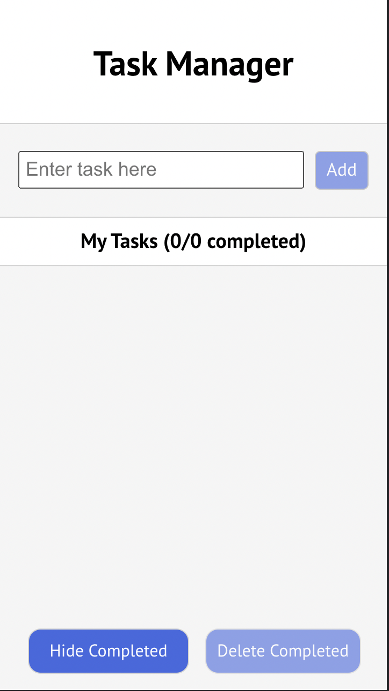
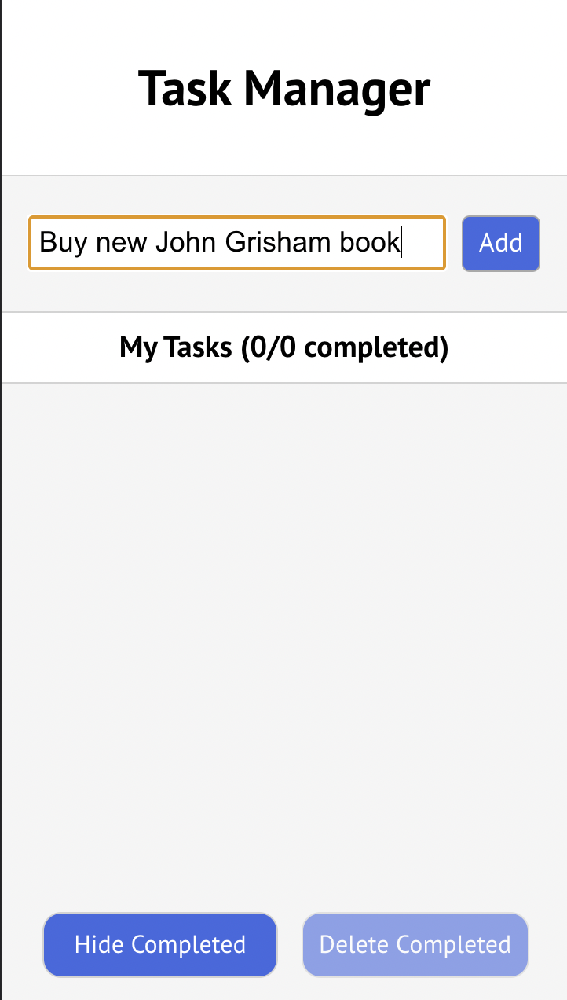
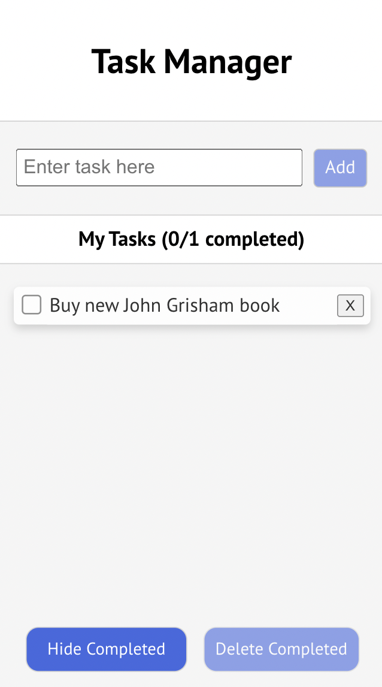

- Before: The initial state is an empty task list.
- During: Typing in text in the text box and clicking add
- After: The new item appears in the list

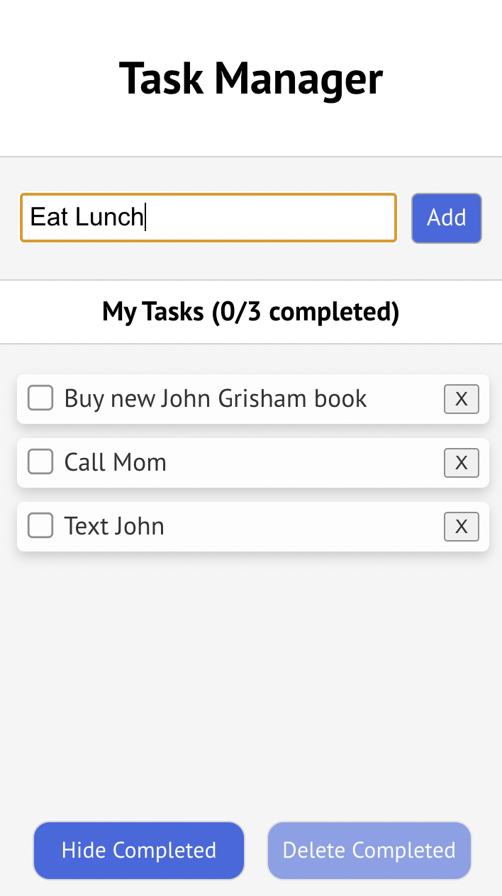

- Before: A list with items
- During: Typing in text in the text box and clicking add
- After: The new item appears in the list

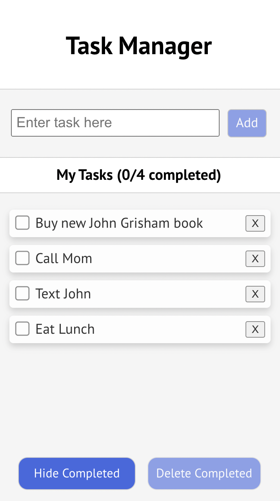
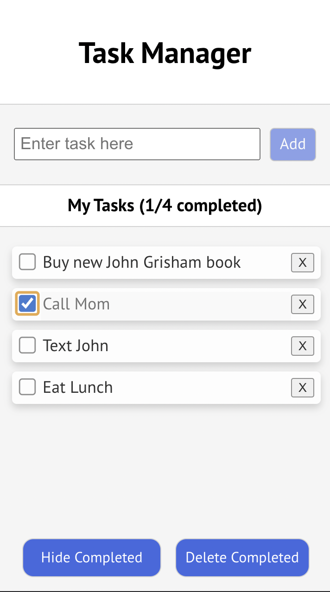
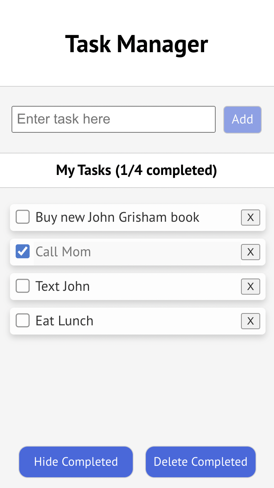

- Before: An unchecked list
- During: Clicking the check box
- After: A clicked check box that is registered as complete

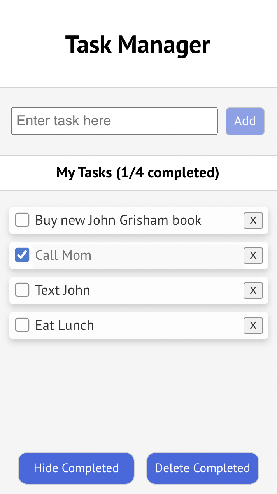
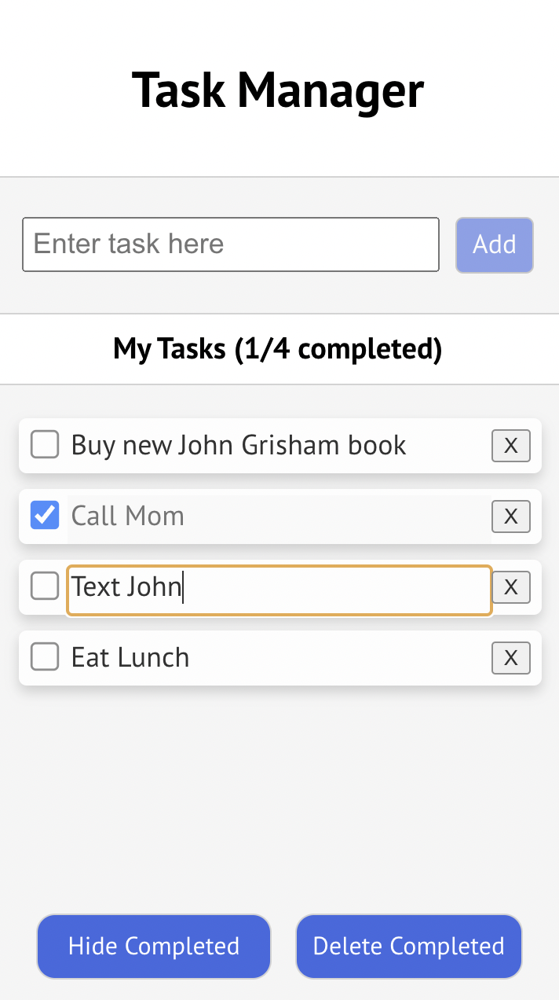
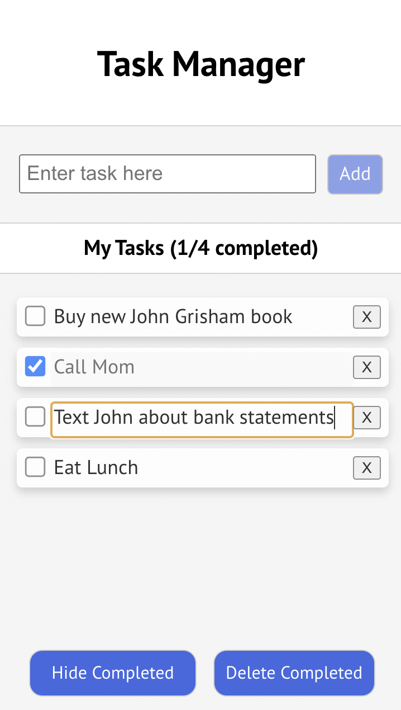
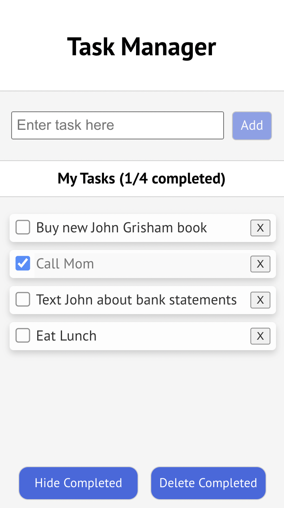

- Before: "Text John" as an item
- During 1: Clicking the text as the edit box (the box has a orange border to signal that it's editable)
- During 2: Typing in "Text John about bank statements"
- After: Leaving the edit box by clicking out of it

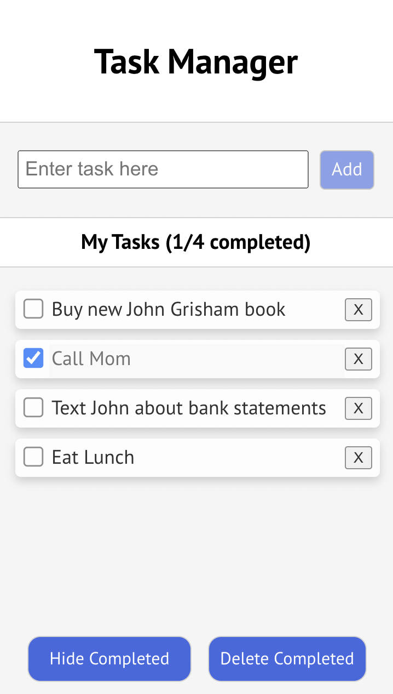
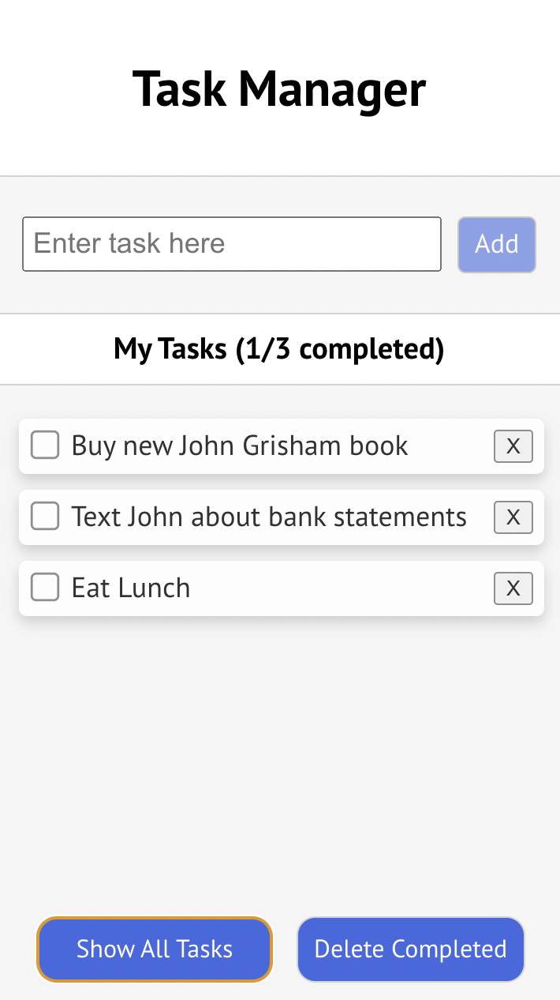
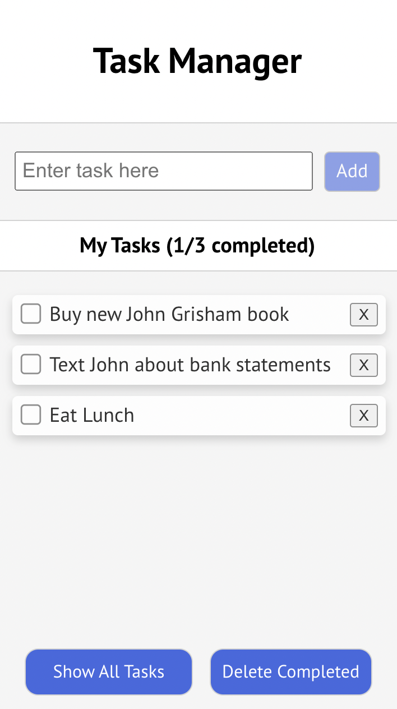

- Before: A shown list with one completed item
- During: Clicking the "Hide Completed" button
- After: "Hide Completed" becomes "Show All Tasks", checked items are hidden and can be brought back

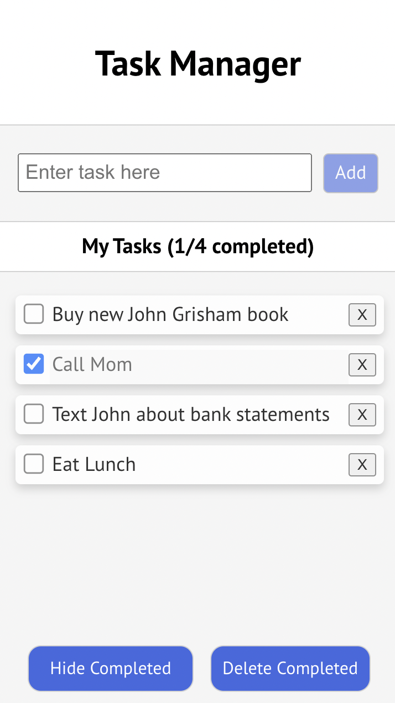
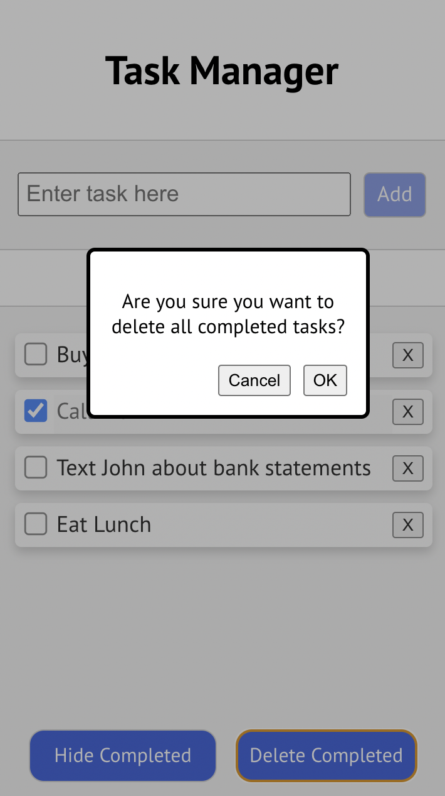
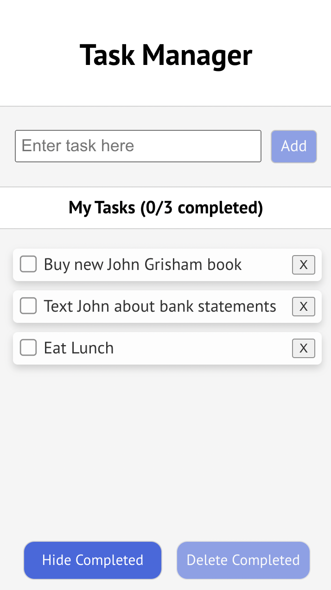

- Before: A shown list with one completed item
- During: Clicking the "Delete Completed" button opens a confirmation dialog box, in which "OK" is pressed
- After: The item(s) are deleted, the "Delete Completed" button is greyed out
