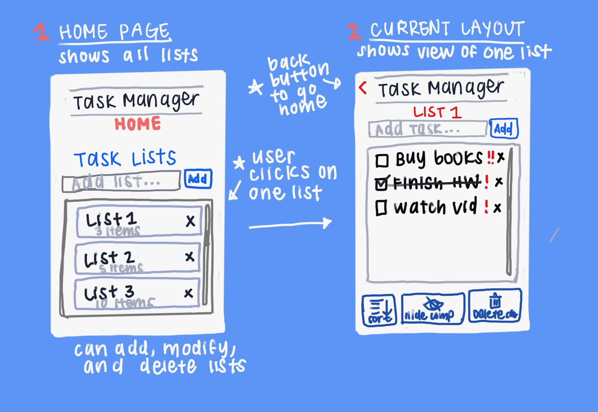
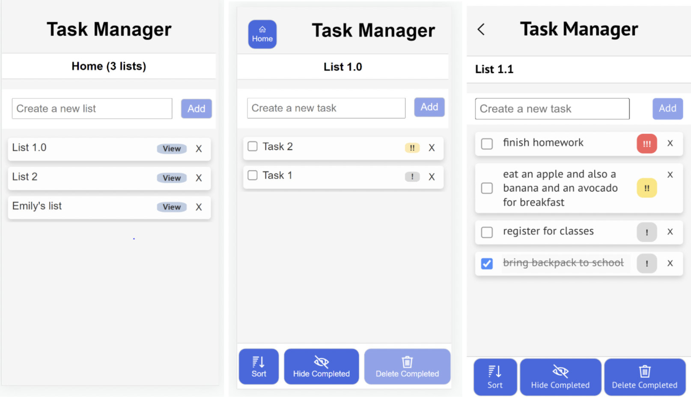
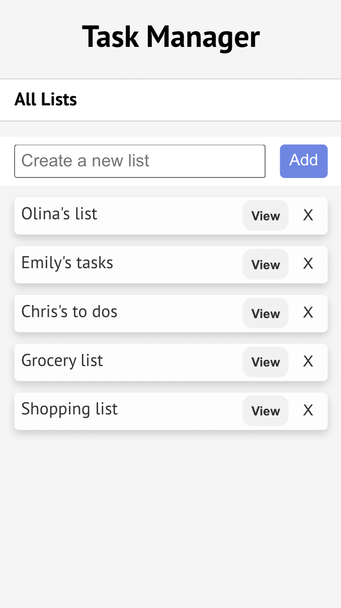
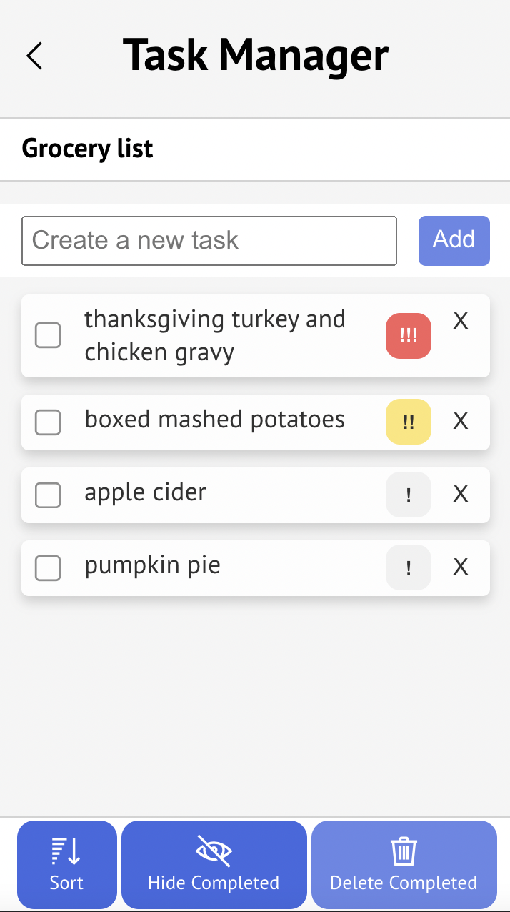
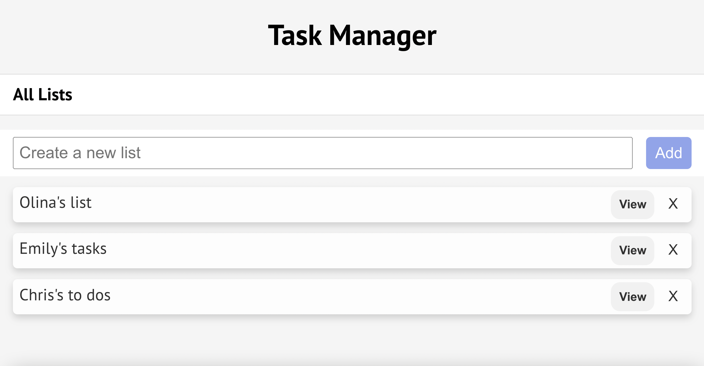
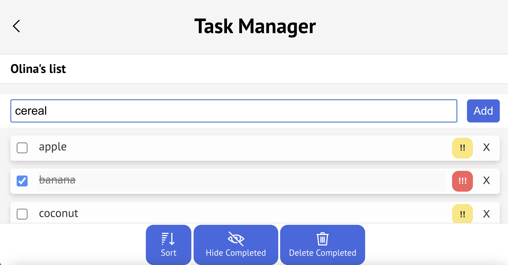
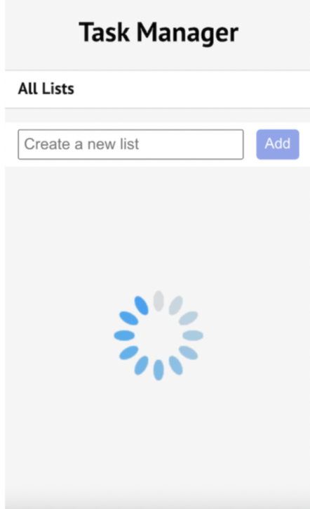
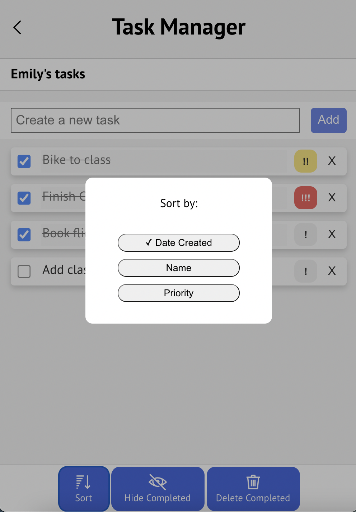

# Lab 4: Responsive Task Manager App supporting multiple lists
**Group members:** Olina Wong, Emily Zhang, Christopher Chung 

In Lab 4, we iterated on our working Task Manager app from the previous lab to design a more accessible, flexible application by supporting 3 new key functionalities.
- make the application accessible
- add support for multiple lists (rather than just a single list of tasks).
- add support for multiple screen sizes (desktop/mobile/landscape/portrait).

The app continues to handle various tasks including creating, renaming, and marking items as well as showing uncompleted items and deleting completed items – all this data is stored in real-time through Firestore. For final screen images and flows for each task, see the bottom of this design doc. 

Quick references:
1. github pages: http://em-zhang.github.io/cs124
2. video recording (showing accessible design): 

### Design Process, Decisions, and Early Mock-Ups
The following is a mock-up of our original design idea for the interface, which consisted of a home page and list subpages. We also did a bit of iteration to arrive at the final layout of our homepage and listpage UI.

### Key Design Decisions
- **Adding a homepage:** To allow users to navigate back to the homepage, we added a back button ticker at the top left, which is consistent with many common app interfaces. In order to enter the specific pages for lists, users can click on the view button associated with a particular list in the homepage.
- **Supporting multiple list functionality:** We implemented a consistent styling for both our homepage and subpages. We also display the name of the active list at the top.
- **Supporting responsive design and accessible design:** We ensured that navigating through the app with either voiceover or the keyboard was a seamless process.

### Alternative Design Decisions
- **Single-page app supporting multiple lists:** An alternative idea we thought about was displaying all the lists on a single screen. While this would be easier to implement and make for a single-page app, the user would have to scroll down a very long page of tasks in order to get to their desired list. This will be helpful especially in future iterations of the app when the user is asked to log in.
- **Sidebar to navigate between multiple lists:** We also considered the alternative of implementing multiple lists with a sidebar or dropdown menu. We thought that this would work well for desktop displays but could be difficult accessibility-wise for mobile displays.
- **Back button to return home:** We considered moving the back button to the toolbar, but thought this would be confusing because the toolbar buttons modify the specific data on the list. We also considered adding a home button with an icon and caption, but realized that this took too much screen real estate and could be distracting.

### User Testing
We tested our app with 5 users. 2 of these were users who had seen previous iterations of our app and 3 were new users who were seeing the app for the first time. We asked users to carry out different tasks and explore the functionalities of the app as if it were a real to-do app they downloaded and used on a daily basis. Users created new tasks, edited their tasks, using the buttons in the navigation bar to sort and delete complete tasks, and also modified the task priority. We asked test users to switch between the home page and list pages, encouraging them to talk out loud and articulate parts of the process that were unclear.

Some key questions we asked were:
- What are you trying to do? (Determining intended purpose)
- Does this workflow make sense to you? (Asking for intuition)
- What do you think will happen if you click on this button? (Asking for intuition)
- Why did you choose to click this button? (Understanding user rationale)
- Is there anything you’re confused about? (Clarity of content)
- If you were to use this app, what would be the most common functionalities you would use?

We had positive reception for the clean user interface to navigate between the home screen and the specific lists. New users understood that you could click on the “View” button to easily access and modify the data for one particular list. 
In addition, we asked one of these users to navigate through the app with a screen reader and also entirely from the keyboard to get their feedback on the accessibility of the app. We received positive feedback and incorporated a couple suggestions:

- There should be no voiceover for buttons that are greyed out or unable to be used, otherwise it could be confusing for the user. They should be read again when they are usable.
- When a pop up has opened (like the sort menu), users should only be able to access the options on the modal via the keyboard.

A few general suggestions that we later incorporated:
- We modified the UI slightly such that text was bigger, buttons were more obvious that they were clickable, and colors were brighter.
- The interface for the home page should be consistent with the list subpages in layout and functionality, so we made sure that we used similar CSS and added a header to differentiate between the pages.
- We further improved the responsiveness of our application, especially for desktop and larger screen sizes.
- We modified the back/home button on the lists page to a back ticker instead of a visual home icon with a “Home” caption because the ticker was more simple and intuitive for users.
In the later sections, we describe the challenges we ran into and parts we’re proud of while taking these suggestions into consideration and implementing these changes.

### Challenges
Some challenges we ran into:
- Making the design responsive, particularly for extending and modifying the size of our task containers
- Implementing multiple lists functionality within Firestore – we had to use useCollection() and keep track of what our current list was in order to perform queries for the data.
- Making sure navigating through the app by keyboard is in the correct order

### Parts We’re Proud of
- Successfully implementing and switching between home page and subpages for lists while maintaining a clean UI
- Further UI touches like adjusting priority buttons (bigger, clearer, more contrast), view button, adding a loading icon to increase serotonin in app users
- Ensuring the design is responsive for different screen layouts

### Final Design
These are screen captures of our app's home screen and one of the list sub-pages. The user will see the screen on the right if they click on the "View" buton of the grocery list on the home screen.

We also implemented responsive design tos upport our application in landscape, portrait, desktop, and mobile screens. This is a capture of a desktop display.

**New Changes to UI**
We made several changes to our user interface to support a cleaner, more intuitive design. We took into account feedback from previous labs and also from our test users.

- We added a loading icon for when the tasks information is being fetched, which will briefly display while tasks are loading.

- We updated the opacity and brightness of our color scheme so that the contrast and visibility were in tune with accessibility standards.
- We updated the modal display buttons and pop-ups so they are aligned and cleaner.

- We made sure that our app is well-aligned (add boxes, buttons, tasks) in accordance with the guest design lecture
