# Lab 3: Task Manager App using Firestore
**Group members:** Emily Zhang, Christopher Chung, Olina Wong

For Lab 3, we iterated on our working Task Manager app from Lab 2 by supporting 3 new key functionalities.
- using Firestore for permanent cloud storage
- adding priority level to tasks
- allowing sorting of tasks by task priority, task name, and creation date (default sorting)

The app continues to handle various tasks including creating, renaming, and marking items as well as showing uncompleted items and deleting completed items – all this data is synced and modified in real-time through Firestore. For final screen images and flows for each task, see the bottom of this design doc.

### Design Process, Decisions, and Early Mock-Ups
Since our last lab, we made many iterations and progressive renders of our app based on user research and testing, as well as research and inspiration from other to-do apps. We created several mock-ups of our app as sketches and as screen images in Figma. 

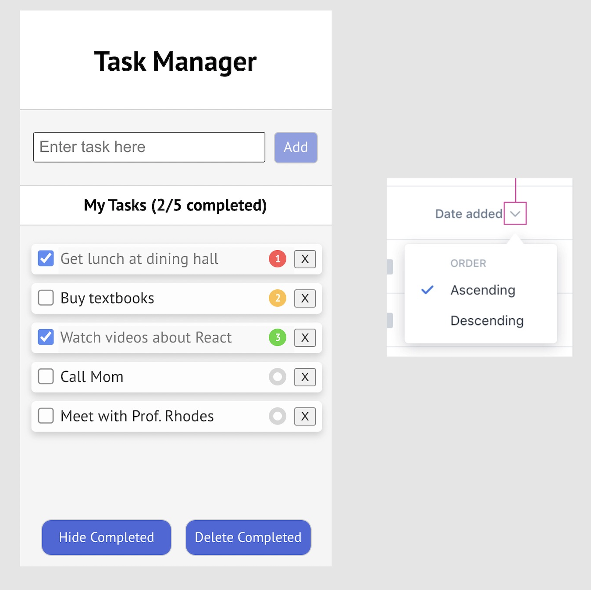

We were inspired by existing task manager apps that display task priority based on color, number, or exclamation marks. We considered alternate designs for displaying task priority, and we settled on using a combination of color and exclamation marks based on positive feedback we received from test users. The following are progressive renders of our app that we modified through user testing. For example, you can see that we changed the color themes of the buttons to reflect a more intuitive sense of priority, and we also moved the location of the sort tasks button to the toolbar so users could easily access this functionality along with "Hide Completed" and "Delete Completed". These changes and decisions are discussed further down below under Design Decisions and User Testing.
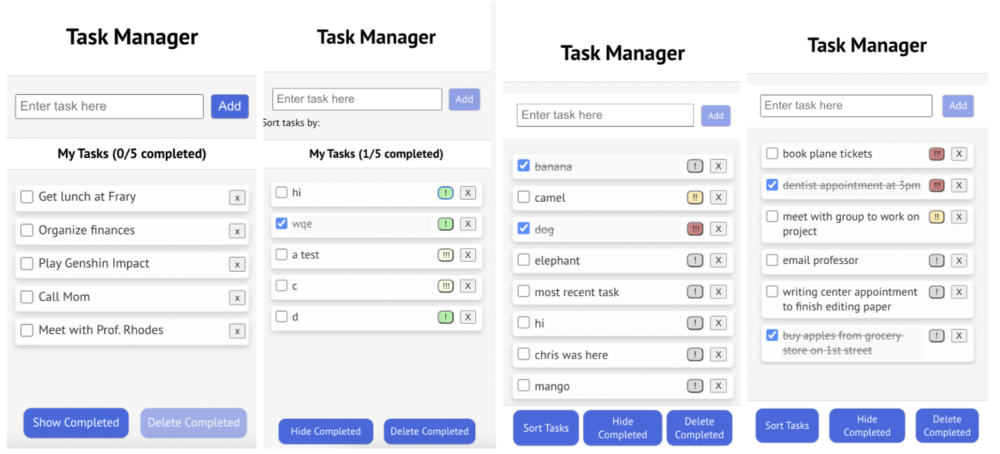

We continued to refine the smaller UI/UX details of our app, until we got to the final general screen images of our app. The following screen images show the following:
1. No tasks have been marked as completed. This is the default view of a full task list.
2. Some tasks are marked as completed. The tasks are sorted by priority in descending order.
3. A preview of the modal that pops up when the user wants to sort the tasks by name, priority, or date created. The tasks are currently sorted by date created.

You'll notice that we refined the look of the buttons and priority displays for the tasks, and we also added icons to our task bar for a more intuitive understanding of functionality.

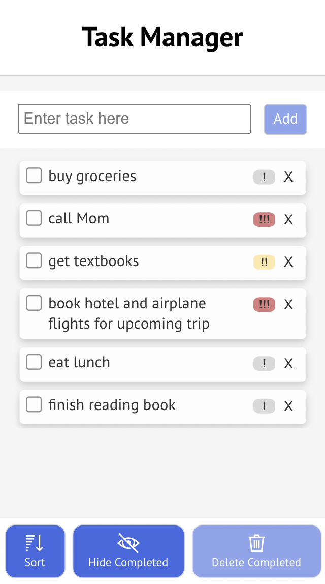
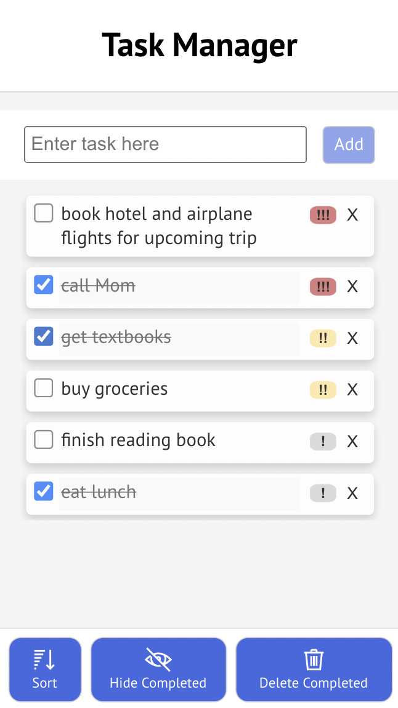
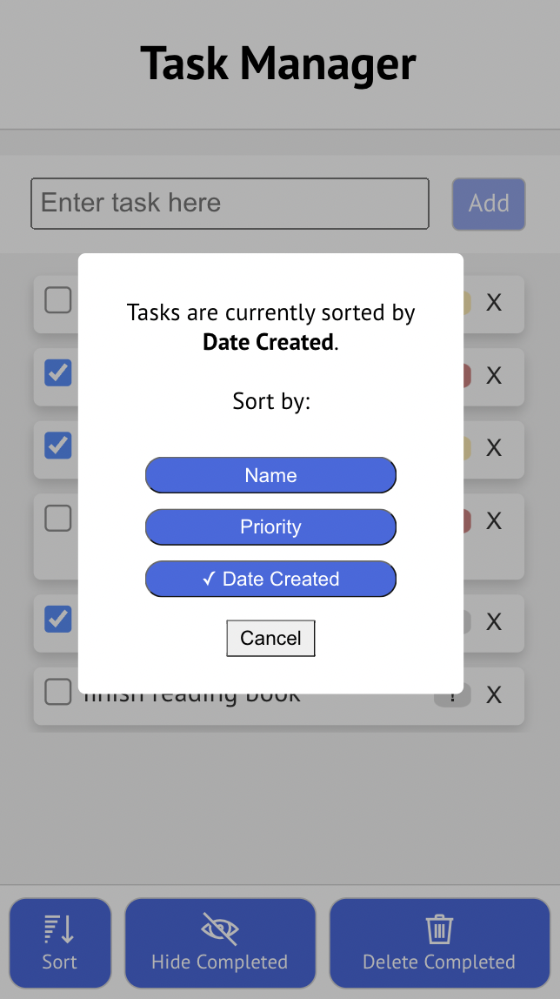

### Key Design Decisions
- **Implementing task priority:** We debated on how to display priority in the most understandable way for the user. Looking at different design paradigms for the user (such as a star system, flag system, exclamation points, numbering, color), we settled on exclamation points. Exclamation points communicate importance and it was within the guidelines of accessible design (not limited by color). Users can click the exclamation points (!) to change the priority (!! or !!!), raising it up the list in a sort by priority.
- **Implementing sorting for tasks:** We made a decision on where to place the sorting function for the user. Following rules of proximity in design, we added a modal button at the bottom toolbar for sorting. We rationalize this location as high level functions the user would commonly access, placing it near the bottom for less cursor/finger distance.
- **A modified, clean, central toolbar:** After much user research and testing we decided to keep all of our functionalites as buttons in the tool bar rather than drop down menus. Through our testing we realized this was the simplest way for users to select options, especially in a smaller mobile screen. We also decided to add unicode icons including a sort icon, hide/show icon displayed by an eye/slashed eye image, and a trash can to represent deleting items.

### Alternative Designs
- **Changing the way we display task priority**: In addition to the current system of adding an extra label/button where the user can easily switch between priority numbers, we considered some alternatives:
- 1. Using a star system to mark priority: We considered a star system, similar to a flag rating system in file organizing UI, to sort the items by priority. Although this would be simple and visual for the user, this implementation would have taken too much screen real estate for a small UI.
- 2. Drop-down selection for changing priority: Another option would be allowing the user to choose between different priority levels on click, which would open up a drop down to select.
- 3. Task boxes on click: We considered implementing our app such that a box associated with a task pops up when the user clicks on a task, and the user could change the task name, task priority, etc. While this would allow us to design within a larger space, we thought that having so many pop-up functions could be confusing for the user, especially on a mobile layout. 
- **Choosing what data to display for a task:** We decided not to display the creation date of a task because it might take up too much screen real estate, especially for longer tasks. Instead, we focused on the key pieces of information that the user cared about, which is what the task actually is, and its priority. Still, users can sort by tasks

### User Testing
We asked 5+ test users who are unfamiliar with the new changes to play with the app and test out desired tasks, such as the functionality of creating a new item, editing a task, using the buttons in the navigation bar, and also modifying the task priority and sorting tasks by different orders. We asked several roommates and friends to navigate through the app, encouraging them to talk out loud and articulate any parts of the process that were unclear. 

Some key questions we asked were:
- What are you trying to do? (Determining intended purpose)
- What is it about this workflow that makes sense to you? (Asking for intuition)
- Why did you choose to click this button/navigate to this position on the screen? (Understanding user rationale)
- Is there anything you’re confused about? (Clarity of content)

We had positive reception for the clean user interface – users were quickly able to understand the concept of task priority as well as sorting tasks. They also really appreciated the simplicity of the tool bar because all the information was readily accessible. Users mentioned that it was easy to navigate through the app to perform different functions and modify tasks, and it was an app that they could use on a daily basis.

A couple key suggestions that we later incorporated included:
- We implemented the sorting options as a modal with a menu where users can selection options as this would be an intuitive way for the user to switch between different views and options.
- Modifying the colors of our priority buttons so that it makes more intuitive sense. Originally we decided the priority levels would be ! (green), !! (yellow), and !!! (red), but we decided to make the lowest priority task a less bold color so it doesn’t confuse the user.
- We decided to add icons in addition to text to our sort bar.
- We fixed our toolbar and added a background so that tasks wouldn't bleed through. We also made it so that pressing enter while editing a task would save the task and would not add a line break (feedback given to us previously).
- We modified the interface slightly to not display multiple headers (My Tasks) because these headers were taking up too much space and users couldn't see tasks.

In the later sections, we describe the challenges we ran into and parts we’re proud of while taking these suggestions into consideration and implementing these changes.

### Challenges
- **Implementing the sort functionality**: The sort functionality took a bit of time to figure out because we had to build the priority based on the sort option that the user selected. We decided to pass this information through state and easily switch between the sort options to build queries.
- **Deciding the UI for a priority system**: The UI for displaying priority and allowing the users to manipulate per item requires a compromise between ease of functionality and screen real estate. We had to optimize for lower number of clicks, ease of understanding, and how intrusive is the UI.
- Other challenges:
- 1. Ensuring that buttons and other functionality are disabled when they can't be used
- 2. Styling and formatting the buttons with both icons and text
- 3. Thinking through different design options when all of them seemed like reaasonable alternatives – user testing helped us with this a lot

### Parts We’re Proud Of
- Designing a simple, intuitive design for task priority. Uses exclamation points, which is more universally understood than our alternative options. Simple to use by clicks
- Reimplementing the toolbar with cleaner CSS and covering the background
- Developing a modal interface for confirmation boxes. Adding icons to the buttons
- Creating a cloud-based storage system for the list information through Firestore

### Final Design
Below you will find the screen images and flow for new changes that we've made since the previous lab:

**Changing the priority of a task**

You can see that the user can simply tap on the priority button and toggle between low, medium, and high priority. Here we are changing the priority of the task "buy groceries".

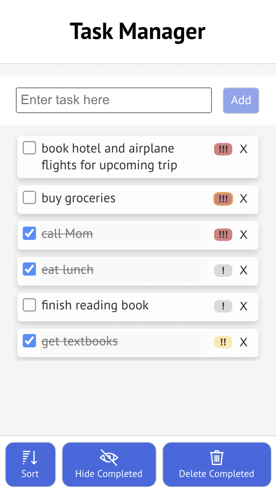

=

**Sorting tasks**

When the user wants to sort tasks, they simply have to create on the Sort button in the toolbar. A modal will pop up and the user will simply select an option – date created, name, or priority. We also display the current sorting option with a checkmark. The user selects one of these options, or can cancel out, and we automatically exit the modal and load the new tasks in the preferred order.

 
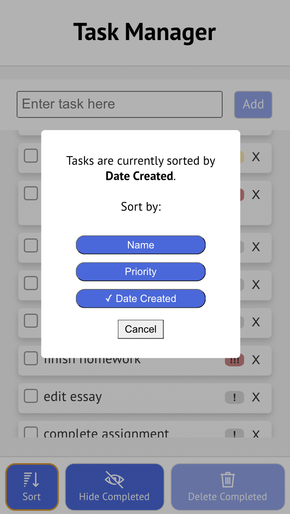
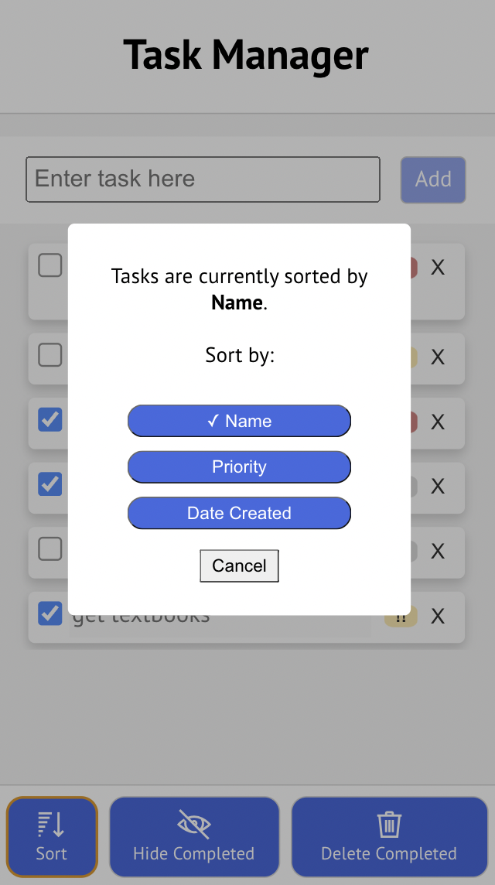
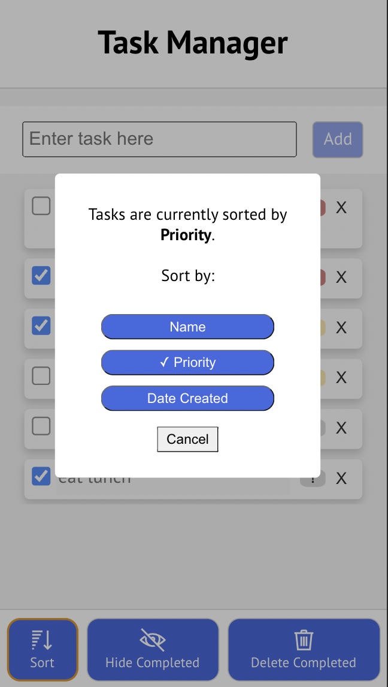

The default sorting is by date created. The following screen images capture what happens after the user clicks on sort by name and sort by priority, respectively.

 
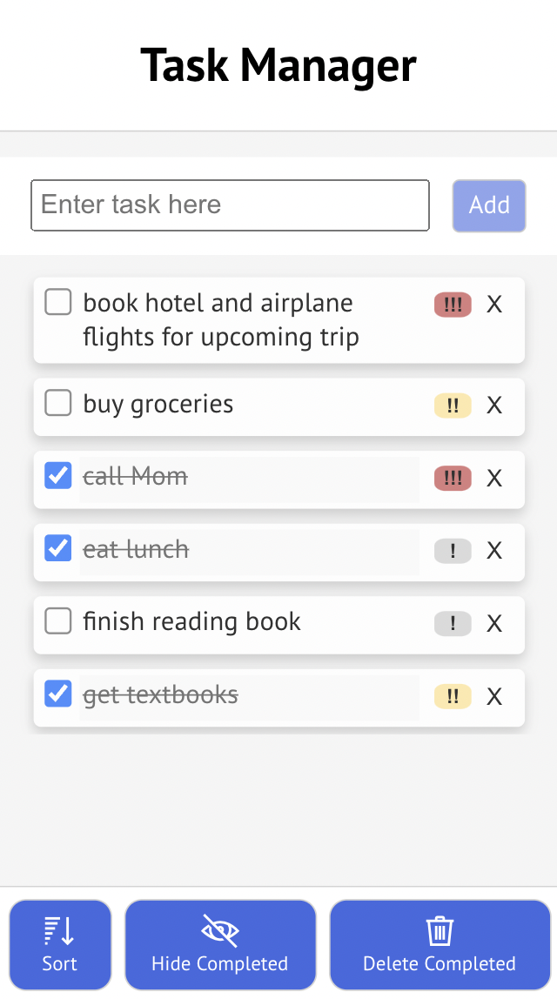
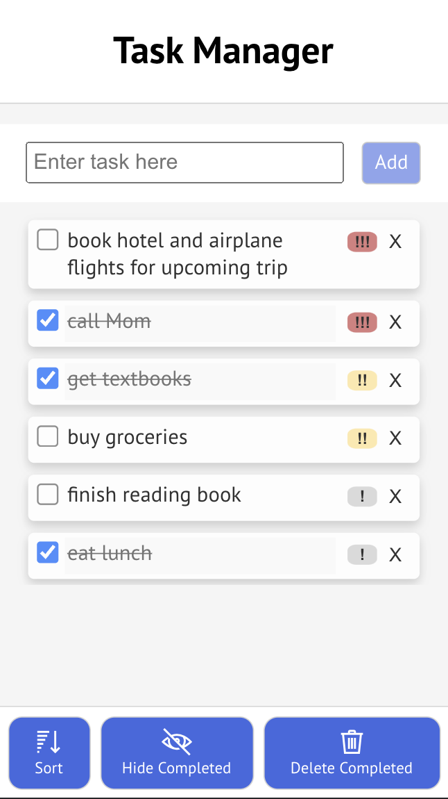

**New Changes to UI**

We implemented several changes to the user interface for basic tasks like editing and deletion. This was based on user feedback that we received. Overall, we wanted to support a cleaner look and prevent user errors.

We added a loading screen for when the tasks information is being fetched, which will briefly display while tasks are loading.

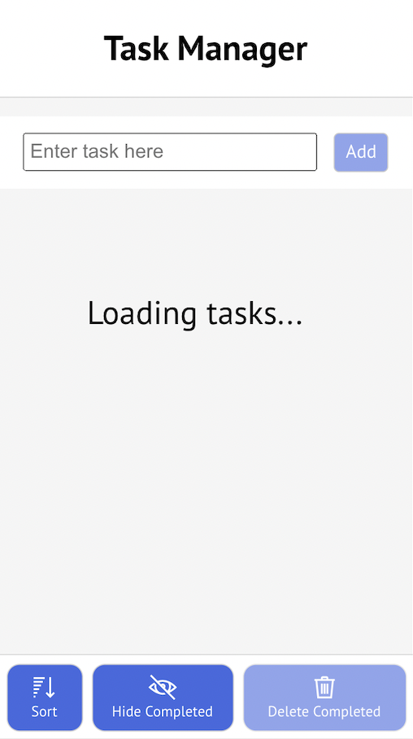

When deleting all completed tasks, more information is provided and users will see the number of tasks that are about to be deleted.

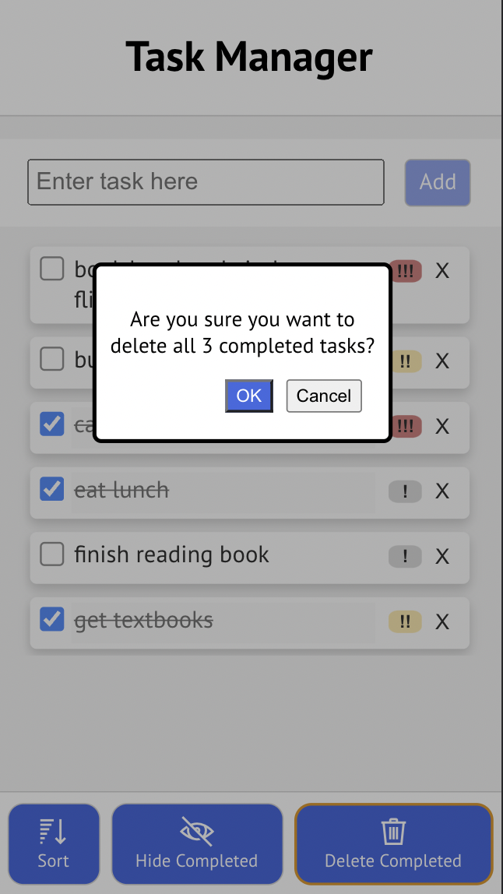

We added a background to our toolbar so that tasks do not bleed under the toolbar. Tasks are now in a separate container such that the user can scroll through the tasks without losing sight of the "add task" bar and header on the screen. For example, this is a screen image where we have many tasks.

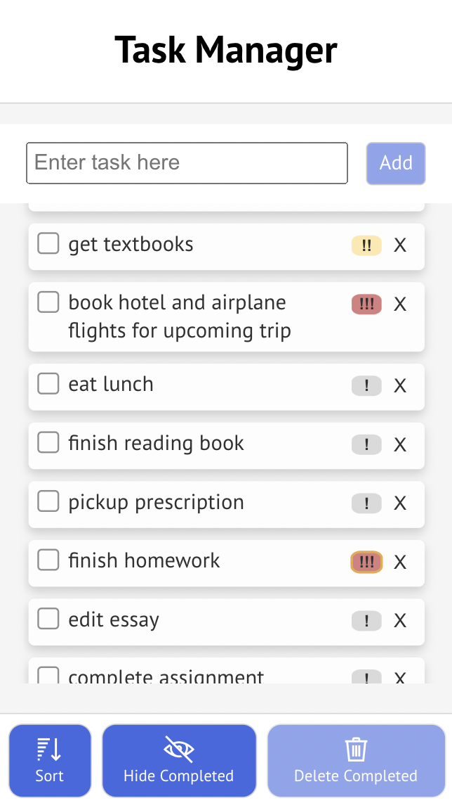

You can find the screen images and flow for the original tasks that we were asked to implement in previous labs. While the interface for our app is slightly more clean, the functionality for these tasks have not changed much.
